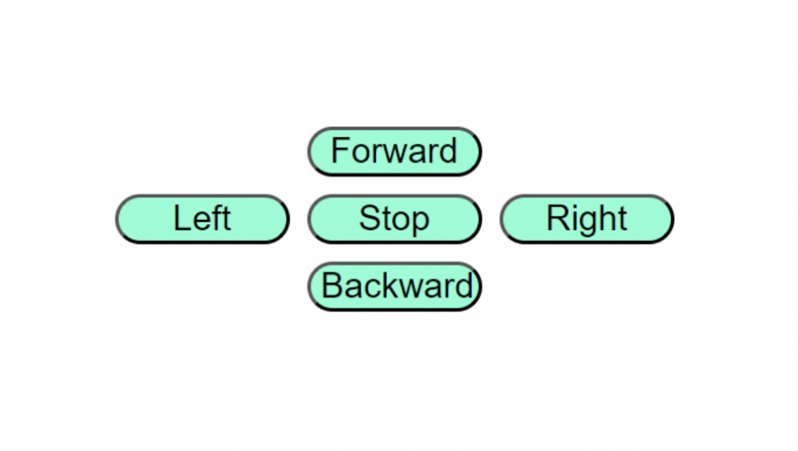
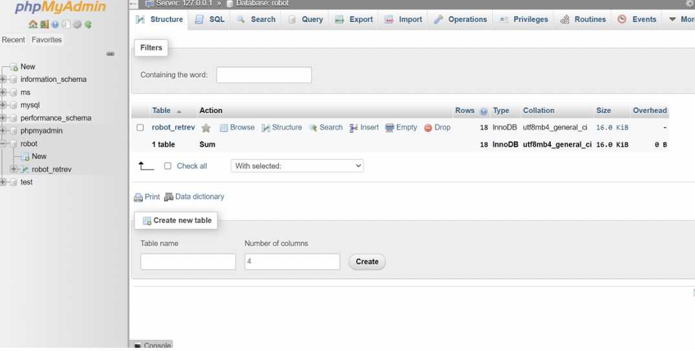
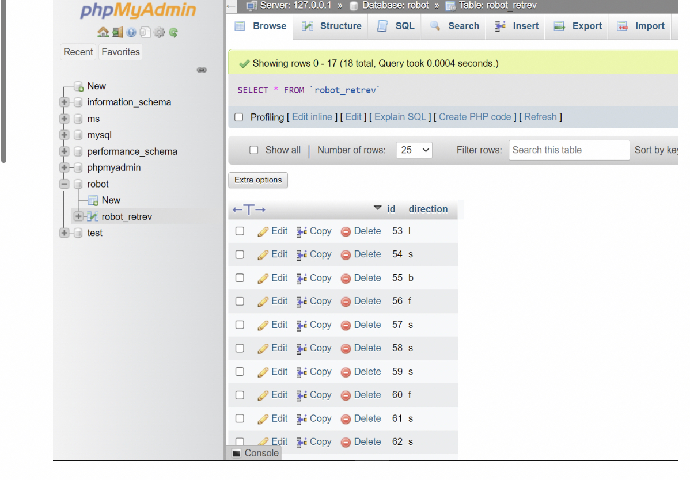
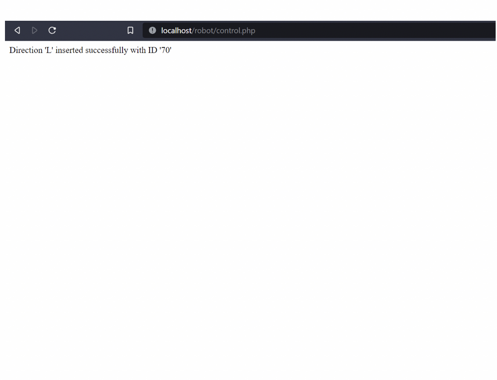

# Web-page-control
### step 1:-
we designed a buttons for controlling and then if you press on the button the value will be stored in the data

### step 2 :- 
we build a data by xmapp local server in the database we have a table call robot_retrev

### step 3 :- 
Finaly should we have a retrive data page from the database

